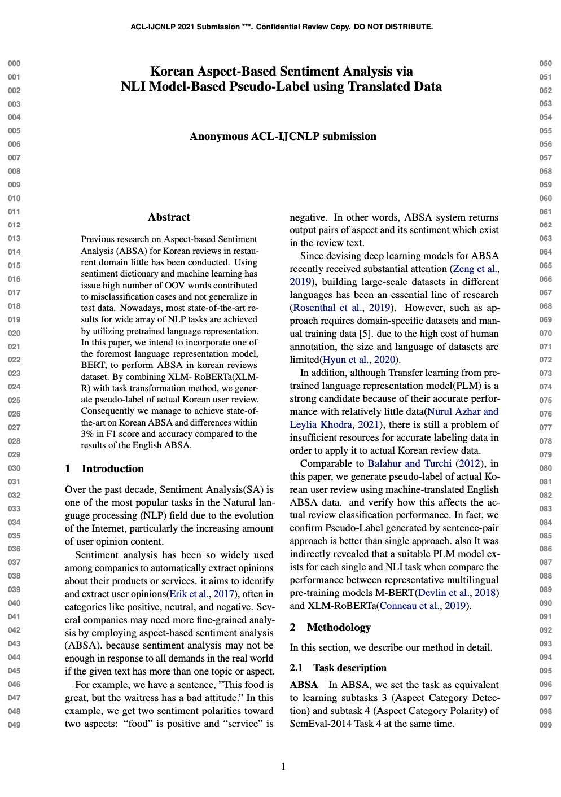

# Korean-ABSA

홍익대학교 산업데이터공학과 졸업프로젝트로 진행한 **"Korean Aspect-Based Sentiment Analysis via NLI model-Based Pseudo-Label using Translated Dataset"** 입니다.

## Abstract

## Dataset
* Kor-SemEval

    * Tranlated [SemEval14 dataset](https://github.com/HSLCY/ABSA-BERT-pair)

* [KR3](https://github.com/yejoon-lee/kr3) subset

    * Train set - Pseudo labeled by fine tuning(Kor-SemEval) model
  
    * Test set - Pseudo Label + Human annotation

## Evaluation 
* **Kor-SemEval**
    * **Aspect Category** (P, R, F1), **Polarity** (4, 3, Binary Acc)
    
| Model         | Precision |  Recall | F1 score | 4-way acc | 3-way acc | Binary  |
|:-------------:|:---------:|:-------:|:--------:|:---------:|:---------:|:-------:|
| M-BERT-single |   92.16   |  77.95  |   84.46  |   68.20   |   71.84   |  77.95  |
| XLM-R-single  |   91.01   |  49.37  |   64.01  |   62.93   |   66.29   |  75.20  | 
| M-BERT-NLI    |   91.10   |  79.90  |   85.14  |   73.95   |   77.90   |  84.87  | 
| XLM-R-NLI     |   91.37   |**83.71**| **87.37**| **79.41** | **83.66** |**89.98**|
| NLI-ensemble  | **93.70** |  81.27  |   87.04  |   78.24   |   82.43   |  89.65  |

* **KR3**
   
| Model            | Precision |  Recall | F1 score | 4-way acc | 3-way acc | Binary  |
|:----------------:|:---------:|:-------:|:--------:|:---------:|:---------:|:-------:|
| M-BERT-NLI+PL    | **92.56** |  84.12  |   88.14  |   84.47   |   86.56   |  88.44  |
| XLM-R-NLI+PL     |   92.42   |**87.25**| **89.76**| **88.69** | **90.78** |**93.07**| 
