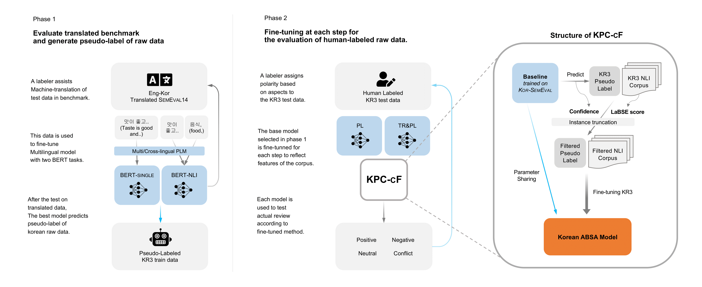
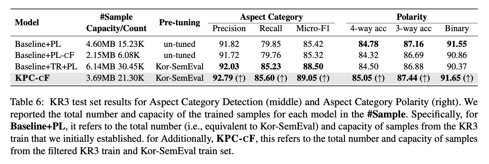
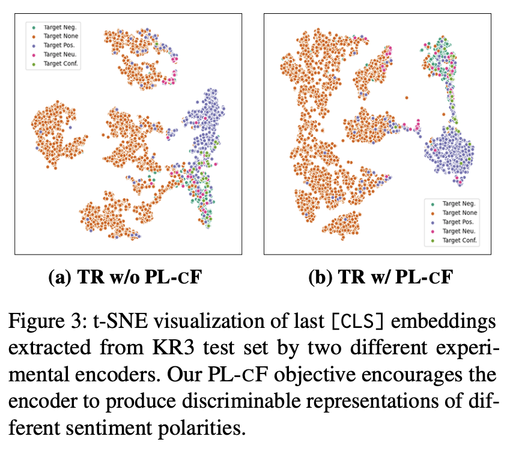
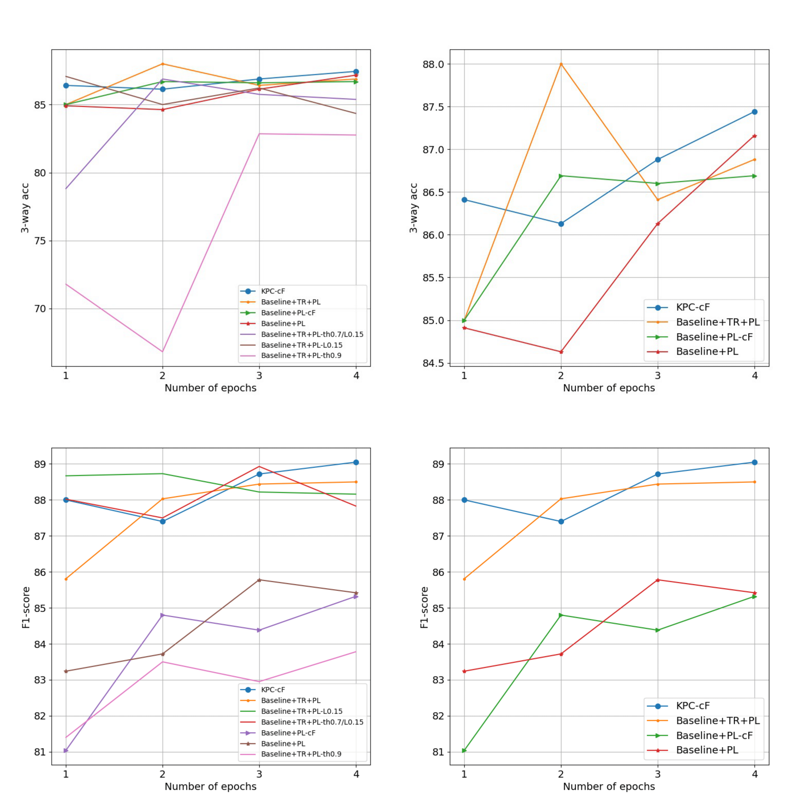

# KPC-cF 

> **[KPC-cF: Korean Aspect-Based Sentiment Analysis via NLI-Based Pseudo-Classifier with Corpus Filtering](https://drive.google.com/file/d/1CeALsl34YL6AUid0kcgX2rycgSIZwDBK/view?usp=sharing)**    
> <!--Kibeom Nam1,2   
> 1 Hongik university 2 MODULABS-->

## Abstract
### Keywords
> ABSA in Low-resource language / Dual filtering
### TL;DR
>  We addressed the language gap issue in ABSA by building a pseudo-classifier. This involved fine-tuning an NLI model with translated data, performing LaBSE scoring on Korean NLI pairs, and further fine-tuning with optimal pseudo-labels.

FULL abstract

> Investigations into Aspect-Based Sentiment Analysis (ABSA) for Korean restaurant reviews are notably lacking in the existing literature. Our research proposes an intuitive and effective framework for ABSA in low resource languages such as Korean. It optimizes prediction labels by integrating translated Benchmark and unlabeled Korean data. Using a model fine-tuned on translated data, we pseudo labeled the actual Korean NLI set. Subsequently, we applied LaBSE and MSP-based filtering to this pseudo NLI set, enhancing its performance through additional training. Incorporating dual filtering, this model bridged dataset gaps, achieving positive results in Korean ABSA with minimal resources. Through additional data injection pipelines, our approach aims to utilize high resource data and construct effective models within communities, whether corporate or individual, in low resource language countries. Compared to English ABSA, our framework showed an approximately 3% difference in F1 scores and accuracy. We will show the model and data for Korean ABSA, publicly available at https://github.com/namkibeom/KPC-cF.

## Flowchart

  

## Dataset
**Kor-SemEval**
> Train set : Machine translated [SemEval14 dataset](https://github.com/HSLCY/ABSA-BERT-pair)   
> Test set : Machine translated + Human 
correction SemEval14

**[KR3](https://github.com/yejoon-lee/kr3) subset**
> Train set : Pseudo labeled by fine-tuning(Kor-SemEval) model   
> Test set : Gold Label

## Evaluation 

**Aspect Category Detection (ACD)**
> Precision, Recall, F1 score

**Aspect Category Polarity (ACP)**
> 4-way, 3-way, Binary Acc

**KR3 test**

  

## t-SNE visualization of last [CLS] embeddings extracted from KR3 testset by two different experimental encoders

 

<!--
## Performance of ACD and ACP during fine-tuning 

 

-->
## To-Do List

- [ ]  Inference code
- [ ]  Training code

## Acknowledgement
> This research was supported by Brian Impact, a non-profit organization dedicated to the advancement of science and technology.
